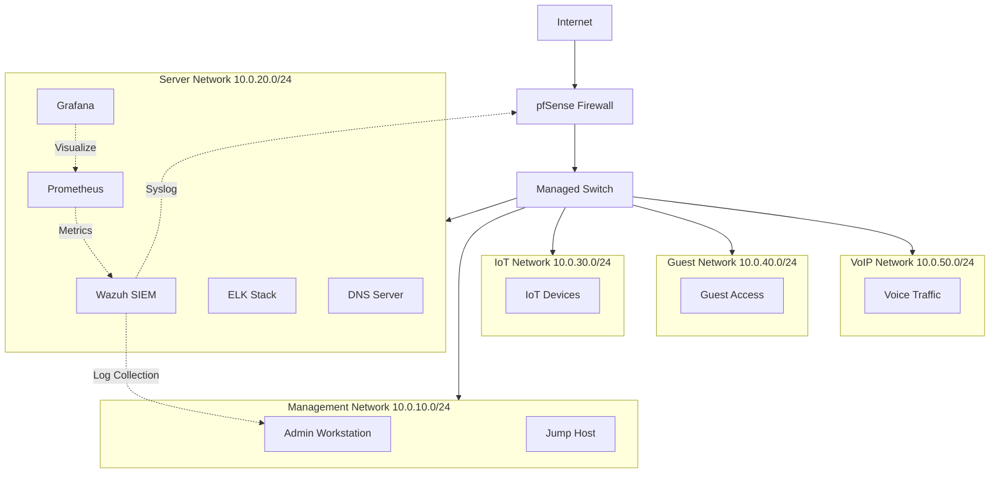

# network-security-lab

[](https://github.com/vtino17/network-security-lab/actions)
# Network Security Lab

[](LICENSE)
[](https://github.com/vtino17/network-security-lab/stargazers)
[](https://github.com/vtino17/network-security-lab/commits)
[](https://github.com/vtino17/network-security-lab)
[](https://mikrotik.com)
[](https://wazuh.com)

Enterprise-grade network security architecture with integrated monitoring, SIEM, firewall management, and automated deployment.

## Architecture Overview



## Components

| Component | Purpose | VLAN |
|-----------|---------|------|
| pfSense | Firewall, VPN, DNS filtering | - |
| MikroTik | Layer 3 routing, VLAN segmentation | - |
| Wazuh SIEM | Log collection, alerting, compliance | Management |
| Prometheus | Metrics collection | Monitoring |
| Grafana | Visualization dashboards | Monitoring |
| ELK Stack | Log storage and search | Server |
| AdGuard Home | DNS filtering, ad blocking | Management |

## VLAN Structure

| VLAN ID | Name | Subnet | Access |
|---------|------|--------|--------|
| 10 | Management | 10.0.10.0/24 | Admin only |
| 20 | Server | 10.0.20.0/24 | Internal services |
| 30 | IoT | 10.0.30.0/24 | Isolated |
| 40 | Guest | 10.0.40.0/24 | Internet only |
| 50 | VoIP | 10.0.50.0/24 | Voice traffic |

## Quick Start

```bash
git clone https://github.com/vtino17/network-security-lab.git
cd network-security-lab

# Deploy monitoring stack
cd docker && docker compose up -d

# Configure MikroTik (import via WinBox/CLI)
# See mikrotik/ directory for configuration scripts
```

## Directory Structure

```
network-security-lab/
  topology/         Network diagrams and IPAM
  mikrotik/         RouterOS configuration scripts
  pfsense/          pfSense firewall rules and XML backups
  wazuh/            Wazuh SIEM agent configs and custom decoders
  monitoring/       Prometheus targets and Grafana dashboards
  endpoints/        Windows and Linux hardening scripts
  docs/             Architecture documentation and runbooks
  scripts/          Automation and deployment scripts
  docker/           Docker Compose stacks for lab services
  tests/            Network connectivity and security validation
  ansible/          Ansible playbooks for configuration management
```

## Requirements

- Virtualization: Proxmox VE, VMware ESXi, or VirtualBox
- Firewall: pfSense 2.7+ or OPNsense
- Router: MikroTik RouterOS 7.x (CHR or physical)
- SIEM: Wazuh 4.7+
- Monitoring: Prometheus + Grafana
- Automation: Ansible 9+

## License

MIT

